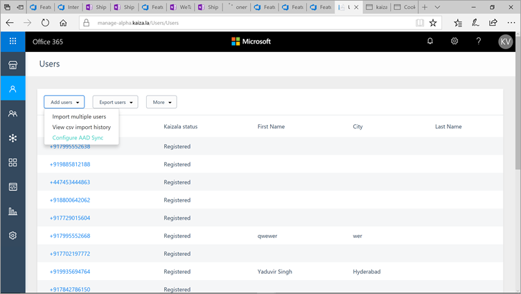

# AAD sync with Kaizala Tenant User List

The Azure Active Directory (AAD) sync feature lets you sync user information in AAD with the Kaizala Tenant User List (TUL). As an admin, you can import data and sync changes occurring in your on-premises AAD. You can use this feature for:

- **User management** - Any new user changes in the directory is automatically synced with the organization admin and associated groups. For example, if a user’s phone number is changed in the AAD, the information will be updated in TUL as well as in the organization groups. Similarly, if a user is deleted from the organization’s AAD, the user is automatically removed from TUL and the organization groups.

- **Dynamic group management** - Allows you to dynamically create and manage groups based on rules and user attributes. For example, you can set a rule to create a group for employees with the *Senior Manager* designation in the *Finance* department.

### Prerequisites

- You must be a Kaizala organization admin with a Kaizala Pro license. 
- Your organization must also have licenses for Microsoft Exchange and SharePoint Online.

## How the AAD sync feature works

- Any new users added in the AAD of the organization will be added automatically to the TUL.
- Users deleted from the AAD will be automatically removed from the TUL and all organization groups.
- Any information change in the AAD will sync with the TUL. For example, if the phone number of a user is changed in the AAD, the number will be automatically updated in all the organization groups. 
- You can import data from a CSV file. However, imported data can be edited unlike AAD synced data that is updated directly only from the directory.

## Configure the AAD-TUL sync

To configure the AAD and Kaizala TUL sync:

1. Log in to the [Kaizala management portal](http://manage.kaiza.la).

2. From the menu on the left, select **Users**.

3. Select **Add Users**, and then select **Configure AAD Sync**.

4. Under **AAD Sync**, in the **Manage Mapping** section:
   - Review and edit name, phone number, and city information of the user to sync with ADD Attribute.
   - Select **Add New Attribute** to add more information. 

5. In the **Sync Frequency** section, choose the sync frequency to meet your requirement:
   - Select **One-time** to sync just once.
   - Select **Recurring** to sync every day. 

6. Select **Next** to start the ADD-TUL data sync. You can check the logs to see the frequency. 
   > [!NOTE]
   > After you select **Next**, the sync process will start and it will take some time for the process to complete. The AAD sync will happen regularly based on the frequency set by you.