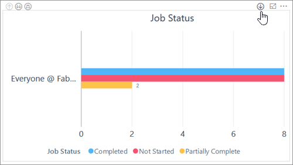

# Action reports in Kaizala

## Surveys

To view survey reports, from the home page, go to **Reports** from the navigation bar. Select the **Survey Report** tile from the list of available reports. This report displays the following information for organization groups: 
  
- Total number of sent surveys.
- Total number of open surveys.
- Total number of responses received for surveys.
- Group wise survey status – how many surveys are still open or active (and which users can respond) versus how many are already closed or expired.
- Count of responses for each survey.

The following filters are available in a survey report:
  
- **Organization group** – Ability to select one or more groups. By default, all permissible organization groups are listed.
- **Survey status** – Filter reports by survey status (open or closed).
- **Survey created date** – Filter reports based on when a survey was created. Select a specific date or a date range.
    
## Detailed survey reports

To view a survey detailed report, from the home page, go to **Reports** from the navigation bar. Select the **Survey Detailed Report**  tile. In the dialog box, choose the group and survey from the drop-down lists. The report consists of five tabs:
  
- **Multi-choice Questions** – This tab shows the summary and detailed analysis of the selected options,for multiple-choice type questions.
- **Numeric Questions** – This tab shows the aggregated as well as detailed responses for each numeric and question, including sum, average, and counts.
- **Location** – If the location is turned on for a survey, then the responses are mapped to a location.
- **Text Responses** – An automatically generated word cloud based on survey responses. Organizations can use surveys to get feedback from their employees and then use this report to visualize the details.
- **Images** – View all the photos collected via a survey in a single place.

## Polls

To view a poll detailed report, from the home page, go to **Reports** from the navigation bar. Select the **Poll Detailed Report** tile. In the dialog box, choose the group and poll title from the drop-down lists. The report consists of only one tab which shows the summary and detailed analysis of choices made for that poll's question. 
  
## Jobs

To view job reports, from the home page, go to **Reports** from the navigation bar. Select the **Job Report** tile from the list of available reports and select an organization group from the drop-down list. The report consists of three tabs: 
  
- **Open Jobs** – Shows the total number of pending jobs, jobs past due date, and jobs still open.
- **Trends** – Depicts the on-time completion trend and a weekly job trend. For each group, this report shows the number of jobs created during a week, as well as their status of completion. Jobs could be Completed, Completed - Past Due, Pending, or Pending - Past Due.
- **Group wise jobs status** – How many jobs are not started, partially complete, or completed for each group.
    
## Location Cards

To view a location report, from the home page, go to **Reports** from the navigation bar. Select the **Location Report** tile from the list of available reports. This report displays the following information for organization groups: 
  
- Locations of users who responded to location actions.
- Groups where the action was sent.
- Names of the responders.
    
## Report filters

Reports may have generic or specific filters that allow users to see reports for specific criteria. For example, users can use the group filter to see data for a specific group. Similarly, users can use the **Create Date** filter to see the Actions for a specific date or date range. 
  
### Report drill-down support

Some reports have drill-down support for hierarchical groups that shows aggregated data and graphs. To turn on the report drill-down mode:
  
- Click or tap the arrow icon as shown here:
    
    
  
## Export Kaizala report data to a CSV file

You can export your Kaizala report data to a CSV file using Power BI. To export the data, click the **…** on the top right corner of the graph, and choose **Export**.
  

  

