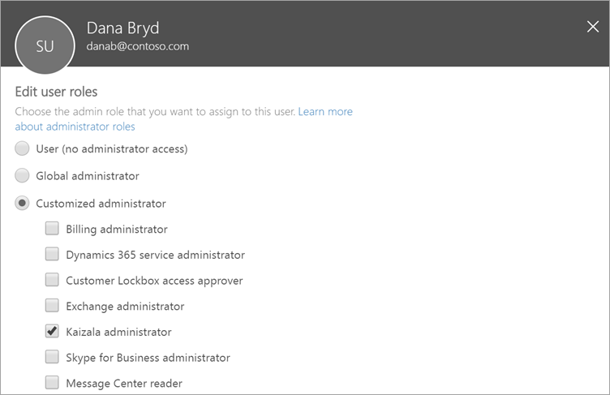

# About Kaizala administrator role in Office 365

Global administrators in Office 365 can assign users the Kaizala administrator role for help with administering Kaizala. The global administrator already has all the permissions of Kaizala administrator. The role assignment can be done from the [Microsoft 365 admin center](http://admin.microsoft.com). 

Users in this role have permission to perform all management tasks within Microsoft Kaizala, including create and manage users in the Kaizala directory, manage Kaizala groups, and manage action cards, connectors, and settings at an organizational level.

Users with this role can sign in to the [Microsoft 365 admin center](http://admin.microsoft.com) and can manage Kaizala service requests.

> [!NOTE]
> Global administrators and Kaizala administrators need to be assigned a Kaizala license to use all available features on the Kaizala management portal. 

## Key tasks of the Kaizala administrator

Here are some of the key tasks that users can do when they are assigned to the Kaizala administrator role:

- [Create and manage Kaizala groups](groups-in-kaizala.md)
- [Add or remove users to an organization’s Kaizala Directory](add-users.md)
- [View and export reports for Kaizala action cards](action-reports.md)
- [View analytics for app installation and usage](adoption-and-activity-reports.md)
- [Manage Kaizala settings](settings.md)

