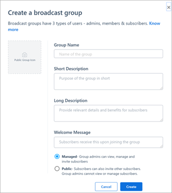

# Connect your value chain Kaizala

Microsoft Kaizala enables you to create company connect groups to establish a mobile communication channel with your entire mobile workforce, partners, and customers.

You can use these groups to:

- Share corporate communications on policy, initiatives, and announcements.
- Conduct required workforce trainings and conduct surveys.
- Collect feedback from employees, partners, and customers.

Engage your workforce by creating a company connect hub with Kaizala: 

- Create company connect groups
- Conduct trainings on Kaizala
- Collect employee feedback with Kaizala

## Create company connect groups

Setting up a company connect group essentially involves setting up a one-way communication channel between the organization and the workforce. This allows the organization to broadcast important announcements and updates and information with the workforce.

In Kaizala, a company connect can be set up by following these easy steps.

### Step 1 – Create a Hub and Spoke group
 
A hub and spoke group in Kaizala is a unique group where members of the group can interact with the admin of the group on a one-to-one basis, but the interactions cannot be seen by other group members. 

> [!NOTE]
> Hub and spoke groups can only be created on the Kaizala management portal. 

Key characteristics of a hub and spoke group:

- Admin can connect with any number of members and send and seek information.
- Members cannot see each other or interact with each other.
- Members can communicate with admins only through admin-defined custom cards such as giving feedback, share your requirement, and so on.
- Members can subscribe to a public group using a link.
- Group can either be managed (group admins can view, manage, and invite subscribers) or public (subscribers can invite other subscribers; group admins cannot view or manage subscribers).

1. On the Kaizala management portal, from the left navigation bar, choose **Groups**.
2. Select **Create Group**, from the drop-down menu, select **Public Group**.

3. Enter the group name, short description, and long description for your company connect group. 
4. If you'd like, enter a welcome message, which subscribers will get once they join the group.
5. Choose between two group types: **Managed** or **Public**.
   - **Managed** group type allows the group admins to view, manage, and invite subscribers.
   - **Public** group type allows subscribers to also invite other subscribers. Group admins cannot view or manage subscribers.
6. If only a few users need to be added, consider adding them manually through the **Users** tab.
7. On the **Users** tab, make sure the phone numbers are from the correct region. Enter a phone number in the text box for every user you want to add to this Kaizala group. You can also enter a list of comma-separated phone numbers. Finally, click or tap Add users. For example, to add three users, enter: 99885544, 99885543, 99885542.

### Step 2 – Add your employees to the group

### Step 3 – Onboard the content moderation team

## Conduct trainings on Kaizala

## Collect employee feedback with Kaizala

