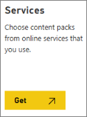

# Kaizala content pack

Use the Kaizala content pack within Power Bi to gain insights on how your organization is using Kaizala. You can visualize and analyze Kaizala usage data, create custom reports and share the insights within your organization. Once the content pack is published, it'll be available through AppSource, and then imported through Power BI.
  
- Visualize data exactly how you want.
    
- Export data sets for storage, future reference, and local usage.
    
- Modify and publish reports in and outside your organization.
    
- Merge imported data with your own data and publish new reports.
    
## Use Kaizala Content packs

Make sure Power BI is part of your O365 subscription. You'll have to sign in with your Office 365 account to Power Bi.
  
1. Log into PowerBI.com with your Office 365 account.
    
2. Choose the **Services** tile. 
    
    
  
3. On the **AppSource** page, search for **Kaizala Survey Reports**.
    
4. Select **Kaizala Survey Reports** and click **Get in now**.
    5. Give your content pack a name and choose **Next**.
    
6. Enter the username and password and click **Sign in**.
    
7. Verify your phone number through the text that was sent to your mobile device, and choose the data you want to import to your workspace.
    8. Choose the group you want to export data from.
    
9. Choose to export from Surveys or custom actions created from the portal, for example, **Surveys and Forms** under **Recurrent Surveys Report**.
    
10. Choose to import one particular instance of the action or all instances of that action type. For example, you may want data of one instance of a custom survey or aggregate responses from all instances where this survey was sent.
    
11. Once you click "Submit", data will be downloaded from the content pack under the pseudonym "Kaizala Reports" to your workspace. Rename the report and start using Power BI's rich feature set to mold data as you see fit.
    
## Creating custom reports from Kaizala's content packs

Once you have imported data from Kaizala's content pack, the data is in your Power BI instance. Power BI provides a rich set of visualizations to connect your data, resulting in a unique view of the report. You can also import third party visuals to create custom reports for your organization.
  
To learn more about power BI's feature set, check out [Power BI's Guided Learning](https://docs.microsoft.com/en-us/power-bi/guided-learning/) resources. 
  

