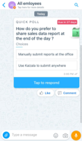
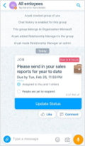

# Digitize everyday tasks with Kaizala

Microsoft Kaizala comes with a bunch of out-of-the-box Kaizala Action cards which can help effectively manage work. For example:
- Use Kaizala surveys to collect field data such as daily sales data, audit reports, and so on.
- Use Kaizala Action cards like attendance and polls anytime, anywhere.
- Use the Kaizala job card and checklist to assign and follow up on tasks remotely.

Kaizala forms and surveys are a great way to efficiently collect data from your mobile workforce. The collected data automatically gets aggregated and reports are made available for in-depth analysis. They are great for enabling scenarios like daily sales data collection, conduct audits, solicit ideas, and so on. 

Get rid of pen and paper and go digital:

- [Get work done with Kaizala Actions](#get-work-done-with-kaizala-actions)
- [Get your workforce up to speed on Kaizala Actions](#get-your-workforce-up-to-speed-on-kaizala-actions)
- [Create your own Kaizala Actions](#create-your-own-kaizala-actions)

## Get work done with Kaizala Actions

Kaizala makes it easy to connect and coordinate with your field workers, wherever they are. Efficiently manage work or collect data from individuals or large groups, even if they’re not in your organization.

> [!VIDEO https://www.microsoft.com/videoplayer/embed/RE2JDVf] 

Get work done in three easy steps.

### Step 1 – Send a survey to collect data from the field

Use the following steps to quickly create a survey to collect data from your workforce in the field. 

1. In the group conversation, in the chat box at the bottom of the page, tap the paperclip icon.
2. Select the **Survey** option, and then proceed to enter the survey details such as title.
3. Use the **Add a question** button to enter questions for your feedback form.

   

   Kaizala allows you to enter question responses as multiple choice, drop-down selection, free text, image, numeric, phone number, and date options.
   
   

   Finally, pick your survey options such as expiry and result visibility.

   

4. Once the questions required to be included in the feedback form are included, go ahead and share the survey with the group. Admins can track how many people have answered the feedback by clicking on the survey card in the chat window.

   

5. The Survey action card can be used for several scenarios where data from mobile or remote workforce needs to be collected and reported on. Some examples are collecting sales data from field agents, conducting remote audits, and conducting a status check on operations. 
6. Detailed reporting on all surveys sent out to your employees (organization) suppliers and partners (value chain) can be viewed on the Kaizala management portal under the **Analytics** section > **Surveys** tab. 

   

### Step 2 – Send a poll to collect user preferences

Use the following steps to quickly create a survey to collect data from your workforce in the field.
 
1. In the group conversation, in the chat box at the bottom of the page, tap the paperclip icon.
2. Select the **Quick Poll** option, and then proceed to enter the poll details such as questions and answer choices.

   

3. Employees tap to respond to the poll.

   

4. Detailed reporting on all surveys sent out to your employees (organization) suppliers and partners (value chain) can be viewed on the Kaizala management portal under the **Analytics** section > **Surveys** tab. 

### Step 3 – Send a job and effectively manage tasks

Use the following steps to quickly create a survey to collect data from your workforce in the field. 

1. In the group conversation, in the chat box at the bottom of the page, tap the paperclip icon.
2. Select the **Job** option, and then proceed to enter the job details such as job description and due date.

   

3. Employees tap to respond to the poll.

   

4. Detailed reporting on all surveys sent out to your employees (organization) suppliers and partners (value chain) can be viewed on the Kaizala management portal under the **Analytics** section > **Surveys** tab. 

## Get your workforce up to speed on Kaizala Actions

In Kaizala, you can make your daily work management easier and more efficient by using Kaizala Actions. It is important to let your workforce know about Kaizala Actions so they can begin to use it in their daily operations.

Use the following step to quickly get your workforce up to speed on Kaizala Actions.

### Step 1 – Send out information materials about Kaizala actions on Kaizala and other communication channels

Send out information materials about Kaizala actions on Kaizala and other communication channels like email using the following resources:

- Posters and infographics – (LINK HERE)
- Email templates  – (LINK HERE) 

## Create your own Kaizala Actions 

You can design a custom Kaizala Action through the Action Designer interface within the Kaizala management portal. This can be done by building on the out-of-the-box Survey Action.

Use the following steps to create your own Kaizala Actions.

### Step 1 – Create a Kaizala custom action

To create a new Kaizala Action:

1. Navigate to **Actions** from the left navigation bar.
2. Select **New Action** from the top right of the page.
3. Select one of the available templates:
   - **New Form** – Use this template to collect data in a form from your group members. The form can be filled at any time.
   - **New Survey** – Use this template to request data from group members. This is done by creating a Survey Action with pre-filled questions. You can send this action via the app at regular intervals.
   - **Feedback** – Use this template to collect any type of feedback from a group.
   - **Announcement** – Use this template to make key announcements and share updates to a group.
4. Fill out the information on the page, and then click or tap **Next**.
5. For a selected template, enter the relevant details described in the following section.

|Menu     |What it's for  |
|---------|---------|
|Action name        |This will be the name of the survey or poll that users see in their Kaizala mobile app.  |
|Brief description  |This will be shown to a user in the discover tab of the Kaizala app.  |
|Customize icon     |Choose the icon for your Kaizala Action.   |

#### Survey & Form Actions

1. Enter a card title. This title will be shown on the card-view of the Action, after the action has been posted.
2. Enter the question details and choose your answer types. You can add more questions by selecting **Add More Questions**. You can even choose to add questions on a new page.
3. After you have entered the question details, click or tap **Next**.
4. On the next page, tap check boxes to select, if you would want the users to find:
   - Action introduction page (where users would find details about the Action)
   - Summary page (where users can review their submissions before submitting their responses)
   - Request for user's location as part of the response.
5. Do relevant customizations on Response View, Immersive View, and Chat view.
6. After you are done, click or tap **Submit**. Users will now be able to see the detail page of the new action. At this moment, the action is in draft state.
7. You need to publish the action. Learn about [the publishing process](https://docs.microsoft.com/kaizala/actions/publish#steps-to-publish-an-action).

### Step 2 – Add Kaizala Action to a group

You can publish a Kaizala Action to one or more groups. When you do so, all the group members will start seeing the action in the Discover tab of the Kaizala phone app. The action only appears to users who are members of the group you selected.
In case of a group having a managed Action palette, added Actions will be visible directly in the group's Action palette.

To add a Kaizala Action to a group:

1. Select the selected group from the **Groups** page.
2. Navigate to the **Action** tab. Click or tap **Add Action**.
3. Select the action that you want to publish. Choose the user roles for which you would like the action to be published.
4. Click or tap **Publish**.

To remove a Kaizala Action from a group:

1. Select the group for to be removed from the **Groups** page.
2. Navigate to the **Action** tab. Find the action that you want to remove.
3. Click or tap (**...**), and then click or tap **Remove**.
