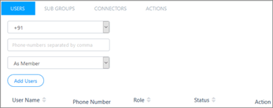

# Get conversations going with Kaizala

Your workforce in the office and in the field needs to communicate and coordinate to get work done. Often this communication happens over unsecured personal messaging apps – putting your organization’s data security at risk. 

Use Microsoft Kaizala to “secure chat” and enable your organization to connect and coordinate across the value chain while retaining complete ownership of work-related chat data. Connect your organization in Kaizala groups that mirror your way of working. 

To engage your workforce and value chain, set up company connect groups:

- [Move your existing groups to Kaizala](#move-your-existing-groups-to-kaizala)
- [Create work groups to meaningfully connect your organization](#create-work-groups-to-meaningfully-connect-your-organization)
- [Invite others to chat securely](#invite-others-to-chat-securely)

## Move your existing groups to Kaizala

Replicate groups that currently exist on unsecure consumer chat apps to Kaizala secure work-related chat. Ensure a seamless transition experience for users so they adopt Kaizala and influence their peers positively to join the change. 

You can move conversations to Kaizala in three easy steps.

### Step 1 – Create a group on Kaizala 

1. Tap **Chats** > **New Group**.
2. Enter a name for your group, and then tap **Next**.
3. Tap **Done** to create your group.

> [!TIP]
> Personalize your groups by using your group photographs for group icon.

### Step 2 – Invite others

1. From the **Chats** list, open the group.
2. Tap on the group name to open the **Group Info** page.
3. On the **Group Info** page, tap **Invite People**.
4. Tap **Share** to send the link to existing groups on consumer messaging apps.

> [!NOTE]
> Anyone who receives the link can join the group. 

> [!TIP]
> Share these posters and training materials in the consumer messaging apps groups to educate users about this change and accelerate adoption.

### Step 3 – Map your group to the organization 

You’ll need to link this group to your organization to ensure data security and to make sure all group data stays with the organization.

1. Tap on the group name to open the **Group** Info page.
2. Tap **More** on the upper right of the Group Info page.
3. Tap **Add to organization**. Once mapping is done, you will be alerted with a prompt.

> [!NOTE]
> If you are not already signed in to Kaizala with your Office 365 email ID, you will get a prompt to sign in at this step. Simply sign in with your Office 365 email ID and proceed to map the group. 

**Resources**

- Template posters for sharing to consumer app groups
- Template posters for Office 365 app sign in and group org mapping

## Create work groups to meaningfully connect your organization

Use Kaizala to meaningfully connect your organization in groups that are mirrored around the way your organization works. For example, Contoso Corp could have several groups, such as 
Contoso – All Employees, Contoso - Finance , Contoso – Sales , Contoso - Sales (East),  and so on.

Use the Kaizala management portal to manage your groups centrally and to add or manage users in bulk (even in thousands) while retaining complete control over chat data. 

You can connect users across your organization in two easy steps.

### Step 1 – Create groups (bulk upload users from management portal)

1. On the Kaizala management portal, from the left navigation bar, select **Groups**.
2. Select **Create Group**, enter the group name, and then click or tap **Create**.

   

#### If number of users to be added are few 

The operation can be done manually on the Kaizala management portal using the **Users** tab.

1. On the **Users** tab, make sure the phone numbers are from the correct region.
2. Enter a phone number in the text box for every user you want to add to this Kaizala group. You can also enter a list of comma-separated phone numbers.
3. Finally, click or tap **Add users**. For example, to add three users, enter: 99885544, 99885543, 99885542.

   

### Step 2 – Onboard group admins/champs who will drive and curate group

## Invite others to chat securely

