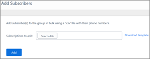

# Kaizala public groups

Kaizala public groups allow enterprises to expose a single channel on Kaizala, where they can connect privately with a large set of Kaizala subscribers. These channels can be used to share and receive information and/or provide updates.
    
# Kaizala Public Groups Types

- **Admins**: Users that can accept or reject subscribers. Also, have the ability to add or remove members and manage the settings on Kaizala
- **Members**: Users that have been added by administrators into a public group.
- **Subscribers**:  Users that have searched and found a public group and wants to be part of it. In some cases it needs the approval of the public group admin.

#Kaizala Demo Page

You have an interactive step by step demo of the Kaizala Admin panel and some of the required configurations at [Kaizala Demo](https://kaizalademo.office.com/). Check it out!.

## Create a public group

- On the Kaizala management portal, from the left navigation pane, choose **Public Groups**. Then select **Create new** and enter group picture and info. Finally click or tap **Create**.
    
    
  
After a public group has been created, you can add more admins and members to it.
  
## Add subscribers

After you create a public group, you can add subscribers to it. Once they have been added, the public group will be made visible to them.
  
- To add subscribers, select a public group, and then click **Add Subscribers**. You can only add subscribers using a CSV file. This makes it easy for you to add them in bulk.
    
- On the **Add Subscribers** page, download the CSV template and follow the format to add your subscribers. Save your file when you're done. [Add several users at the same time to Office 365 - Admin Help](https://support.office.com/article/1f5767ed-e717-4f24-969c-6ea9d412ca88#__toc316652088).
    
- Click **Select File** to choose the file you just saved and then click **Add**.
    

  
## Invite subscribers

You can also invite subscribers by sending them a link that you can generate. Users can then click on the link to join the public group as subscribers.
  
- To invite subscribers, select a public group, and click **Generate invite link**.
    
- Copy the link and send it to the people you want. Once they click the link, they get subscribed to the public group.
    

  
Public groups are managed through the Kaizala Management Portal by public group admins. Organization group admins can manage all public groups in their organization.
  

