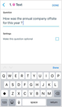

# Get work done with Kaizala Actions

Kaizala offers a wide range of action cards or mini apps that make your daily work management easy and efficient. You can use the out-of-the-box Action cards or create your own customized Kaizala Actions. Let’s get you started with some of the Kaizala Actions such as survey, attendance, and job that can help you get work done.

> [!VIDEO https://www.microsoft.com/videoplayer/embed/RE2JDVf] 

## Step 1 – Use a survey to collect data from the field

Surveys are great for collecting data from the field. For example, getting daily sales data from your field sales team. 

1. In the group conversation, in the chat box at the bottom of the page, tap **Attachment** .
2. Select the **Survey** option, and enter the relevant details such as title.
3. Use the **Add a question** button to enter questions on the form.

   

   You can pick the question response types, such as multiple choice, drop-down selection, free text, image, numeric, phone number, and date options.
   
   

   Finally, pick your survey options. You can decide when the survey will expire and whether you want to make answers visible to others.

   

4. Once you’re done setting up the questions, share the survey with the group. Admins can track how many people have answered the feedback by selecting the survey card in the chat window.

   

5. You can use the Survey Action card for several scenarios where data from remote workers needs to be collected. Some examples are collecting sales data from agents, conducting remote audits, and checking on faraway operations. 
6. Detailed reporting on all surveys sent out to your employees, suppliers, and partners can be viewed on the Kaizala management portal under **Analytics** > **Surveys**. 

   

## Step 2 – Send a poll to collect user preferences

Use the following steps to quickly create a poll to collect data from your workforce in the field.

1. In the group conversation, in the chat box at the bottom of the page, tap **Attachment** .
2. Select the **Quick Poll** option, and enter the relevant details such as questions and answer choices.

   

3. Employees can tap to respond to the poll.

   

4. Detailed reporting on all polls sent out to your employees, suppliers, and partners can be viewed on the Kaizala management portal under **Analytics** > **Polls**.

## Step 3 – Send a job and effectively manage tasks

Use the following steps to quickly send out jobs and tasks to remote workers. 

1. In the group conversation, in the chat box at the bottom of the page, tap **Attachment** .
2. Select the **Job** option, and enter the relevant details such as job description and due date.

   

3. Employees can tap to respond to the poll.

   

4. Detailed reporting on all surveys sent out to your employees, suppliers, and partners can be viewed on the Kaizala management portal under **Analytics** > **Jobs**. 

*Next>* [Create your own Kaizala Actions](create-custom-actions.md)