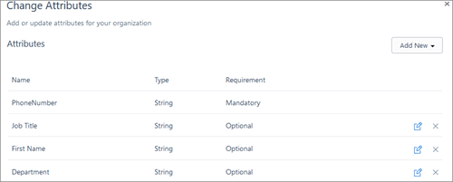
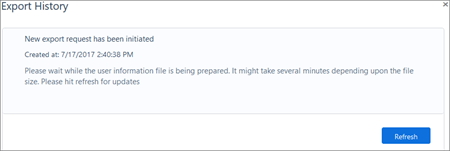

# Create Kaizala users

Before you can send instant messages, pictures, and documents, or set up a new poll or survey, you'll have to create Kaizala users. You can add users individually or in bulk. For managing users in groups, see [Kaizala groups](groups-in-kaizala.md).
  
## View all users in an organization

On the Kaizala management portal, from the left navigation pane, choose **Directory**. You'll see a list of all users who have access to your organization. This includes users who were uploaded directly through the **Import Multiple Users** process, along with the members of organization groups mapped to your organization. 
    
You can also show up to four columns of information about users by choosing **More**  \> **Select Columns**. 
  

  
Kaizala organization admins can define and manage user attributes for an organization. They can add custom user attributes (for example, employee ID or manager) in the Kaizala management portal, which makes it easier for admins and other users to identify a user.
  
### Set up attributes for all users in the organization

- Select **Directory** \> **More** , and then select **Change Attributes** from the drop-down menu. 
    
- To add a new attribute, select **Add New**, and then choose from a range of pre-defined suggested attributes or add a new one. 
    
    
  
  - You can decide whether it's optional or mandatory for users to enter data for an item selected from the suggested attributes.
    
  - For a custom attribute, you can enter the name of the attribute, select its type (string, number, Yes/No, and date/time), and select whether it is mandatory or optional for users to enter data for it.
    
  - Once you've made changes to the attribute, select **+** to add it to the list, or **-** to remove it. 
    
  - You can add multiple attributes at once.
    
- Once you've finalized the list of attributes, select **Save** to add the new changes to the organization's attribute list. 
    
## Add users in bulk to your organization

If you want to add several users without using the comma-separated list, you can do so using **Bulk upload**. 
  
1. Select **Directory** \> **Add Users**, and then select **Import Multiple Users**. 
    
2. On the **Import Multiple Users** page, download the CSV template. [Add several users at the same time to Office 365 - Admin Help](https://support.office.com/article/1f5767ed-e717-4f24-969c-6ea9d412ca88#__toc316652088).
    
3. Follow the template to add your users and their phone numbers to Kaizala. Save the file in .csv format.
    
4. Choose **Select a File**, and then select the file you saved above. Finally, select **Upload**. 
    
    
  
5. On the **Upload Users History** page, you can check the status of the uploaded file. Select **Refresh** to get the latest status. If the status is **Completed**, you can find the updated user list on the Users page. 
    
> [!NOTE]
> You can update information for an existing user by uploading the file again with updated data for that user. 
  
## Find history of all user upload operations

1. Select **Directory** \> **Add users**, and then select **View Import History** from the drop-down menu. 
    
    
  
2. On the **View Import History** page, you can find a list of all user upload operations. Each list item has the following info: 
    
  - **File Name** - the name of the file
    
  - **Uploaded by** - the person who uploaded the file
    
  - **Date** - time stamp when the file was uploaded 
    
  - **Status** of the uploaded file. This can be one of the following values: 
    
     - **Processing** - the file has been sent for processing and hasn't been uploaded yet. 
    
     - **Completed** - the file has either been successfully uploaded, or partially uploaded  due to some errors. 
    
     - **Failed** - the file hasn't been uploaded successfully. Download the error log file for the upload to check out any issues. 
    
  - **Download** - select the icon to download the originally uploaded file. 
    
## Export users' data for your organization

1. Select **Directory** \> **Export Users**, and then select **Create New Request**. 
    
    
  
2. On the **Export History** page, you can check the status of the export request. Select **Refresh** to get the latest status. If the status is **Completed**, you can download the requested file by selecting the download icon beside the specific request. 
    
## Find history of all export users operation

1. Select **Directory** \> **Export Users**, and then select **View Export History**. 
    
2. On the **Export History** page, you can find a list of all user upload operations. Each item has following information: 
    
    
  
  - **File Name** - the name of the file
    
  - **Exported by** - the person who exported the file
    
  - **Date** - time stamp when the file was exported
    
  - **Status** of the exported file. This can be one of the following values : 
    
    - **Queued** - the request has been queued. 
    
    - **Completed** - the file has either been successfully exported, or partially exported due to some errors. 
    
    - **Failed** - the file wasn't exported successfully. Download the error log file for the upload to check out any issues. 
    
  - **Download** - select the icon to download the requested export file. 
    
## Find a detailed view of user's profile in the organization

To find a detailed view of a user's profile:
  
1. Select **Directory**, and then select a user from the user list for your organization. 
    
2. Choose the phone number for that user to see a detailed view.
    
## Remove a user from a Kaizala group

1. Select **Directory**, and then select a user from the user list for your organization. 
    
2. Choose the phone number for that user to see a detailed view.
    
3. On the details page for the user, select **Delete**, which will remove the user from the organization. Once you delete a user, they get removed from all organizational groups on Kaizala. All data, including messages, Kaizala Actions and attachments for these groups will be deleted from their device. 
    
## Kaizala user roles

There are three different user roles in Kaizala. Here are the available roles and what people assigned to them can do.
  
|||
|:-----|:-----|
|**Role**   |**What they do in Office 365**   |
|**Kaizala organization administrator**   |Kaizala organization admin is a user who can manage Kaizala for your organization. The built-in Office 365 role,  *global admin* is an equivalent of the Kaizala organization admin. Office 365 global admins will have access and ability to manage all organization groups, even those they aren't direct members or admins of.    |
|**Kaizala group administrator**   |Kaizala Group administrator is a Kaizala Group member with special privileges. Unlike an organization admin, they have to be an admin of the group they are handling to have said privileges. Group admins can perform all the actions a organization admin can, but only on the groups they are explicitly made an admin of.    |
|**Member**   |A Kaizala user with no special privileges. They can only take part in 1:1 and group communication and view attributes of their own groups and conversations. They can't add or remove other members from the group.    |
   
### What can the Kaizala user roles do?

|**Feature Access**|**Kaizala Org Admin**|**Group Admin**|**Member**|
|:-----|:-----|:-----|:-----|
|Add or Remove Users    |Manage all users of the organization    |Manage Users for groups with direct group admin privileges    |Not available    |
|View Groups    |All organization groups    |Own organization groups with admin role    |Own organization groups with member role    |
|View Groups    |All organization groups in the hierarchy    |All organization groups in the hierarchy    |All organization groups in the hierarchy    |
|Add or remove users from groups    |All organization groups    |Own groups with direct group admin privileges    |Not available    |
|View Connectors    |Self-created or all connecters in org    |Self-created or all connecters in org    |Self-created or all connecters in org    |
|Publish or Unpublish Connectors    |To all organization groups    |To own organization groups with admin role    |Not available    |
|View Actions    |Self-created or all Actions in org    |Self-created or all Actions in org    |Self-created or all Actions in org    |
|Publish or Unpublish Actions    |To all organization groups    |To own organization groups with admin role    |Not available    |
|View Reports    |Reports for all organization groups    |Reports for all organization groups with direct admin privileges    |Not available    |
|Manage groups to Organization mapping (in Settings page)    |All organization groups    |All groups with direct admin privileges    |Not available    |
   

