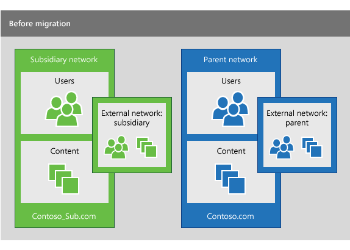
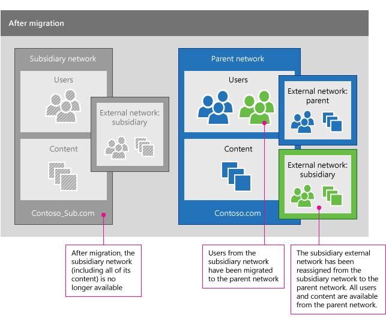
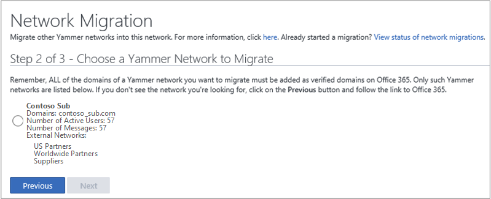
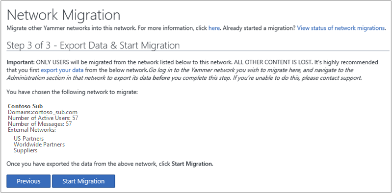
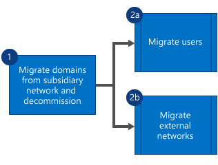

# Network migration - Consolidate multiple Yammer networks

If you have multiple email domains in your Office 365 tenant and those email domains are spread across two or more Yammer networks, consolidating into one Yammer network will be required as of September 26, 2018. 
  
This article is only necessary if you have multiple Yammer networks, for example if your company has multiple business units or subsidiaries, each with its own Yammer network. 
  
Consolidation to one primary network helps get all your employees closely collaborating with each other, and simplifies management of your Yammer network.
  
Here are the basic steps:
  
|||
|:-----|:-----|
|**Step**   |**Description**   |
|[Step 1: Plan](consolidate-multiple-yammer-networks.md#Plan)   |Identify the Yammer networks to consolidate, identify data to export and upload, plan any needed changes to group structure and membership in the primary network, and plan communication with your users.    |
|[Step 2: Export content from primary networks](consolidate-multiple-yammer-networks.md#Export)   |Export all content from secondary Yammer networks. Migration only migrates users, not data. No-one can access the secondary network after the migration begins.    |
|[Step 3: Communicate with all users before the migration](consolidate-multiple-yammer-networks.md#Precommunicate)   |Use the sample communication below to let everyone on the secondary networks know the purpose of the change, the timing, what information will be kept, and the group structure in the primary network. Recommend that users save information they want to keep before the migration start date, such as files and data in conversations. Let primary network users know that more people are joining.    |
|[Step 4: Perform the network migration](consolidate-multiple-yammer-networks.md#self-service)   |Run the network migration tool once for each secondary network. The tool migrates all users from the secondary Yammer network into the primary Yammer network, and turns off the secondary network. It does not migrate any conversation or file data.    |
|[Step 5: Make primary network changes](consolidate-multiple-yammer-networks.md#parentchanges)   |Adjust the structure of your primary Yammer network so it meets the needs of users who will be joining it. Create groups, invite members to the groups, and upload files that you exported.    |
|[Step 6: Communicate with all users after the migration](consolidate-multiple-yammer-networks.md#aftercommunicate)   |Let everyone know the consolidated Yammer network is ready to use.    |
  
For more information, see [FAQ: Consolidating multiple Yammer networks](faq-consolidate-multiple-yammer-networks.md).

## Step 1: Plan

Here are the main questions to ask during the planning step:
  
- Which Yammer networks need to be consolidated?
    
- Which network should be the primary network, and which are the secondaries?
    
- For each secondary network, what content needs to be exported and loaded onto the primary network? 
    
- Who will do the actual migration, export the data, set up the group structure in the primary network, upload data, and communicate with users?
    
- What groups are necessary in the primary network for the users who are coming in from the secondary networks? Who should be in these groups? Who should be the admins for each group?
    
- What's the best way to communicate with the users before and after the consolidation? 
    
- What role should users have in planning the consolidation? Consider using a Yammer group on each secondary network to help plan the changes. 
    
- What's the timing? Do we need down-time? If so, what's the best time to schedule this?
    
Here's what you need to know to plan and organize your network consolidation.
  
- Only users with the global admin role in Office 365 can perform network consolidation. 
    
- When you export data from a secondary network, you'll end up with CSV files containing group, user, admin, file, and conversation information, plus a folder that includes all the files from the network. If you plan to use this information to upload data or set up groups in your primary network, you'll need someone to map the information to what's needed in the primary network, and someone who can use this mapping to set up Windows PowerShell scripts to load the data.
    
- The primary and secondary Yammer networks must be on verified domains in one Office 365 tenant. Consolidating Yammer networks across Office 365 tenants is not supported.
    
- The secondary networks can be either Yammer Basic or Yammer Enterprise, but the primary network must be Yammer Enterprise.
    
- Network migration can't be reversed. 
    
- Multiple network migrations can be started back-to-back, without waiting for the previous ones to finish.
    
- During the migration, active and pending users, including the users' information, such as name and profile picture, are migrated. 
    
- If a user exists in a primary and secondary network, the user's account in the primary network will remain and if needed, will be promoted from a guest account to a regular account. The account in the secondary network will be deleted.
    
- Groups, conversations, and files are not migrated.
    
- After a migration completes, no-one can access the secondary Yammer network.
    
### Example of network consolidation

Here's an example showing Contoso, Ltd. with subsidiaries, each one of which has its own Yammer network:
  
- **Contoso.com** The primary network for Contoso, Ltd.; serves users with emails @contoso.com. 
    
- **Contoso_Sub.com** A secondary network for employees of a division of Contoso, Ltd.; serves users with emails @contoso_sub.com. 
    
- **ContosoPharmaceuticals.com** A secondary network for employees of the Pharmaceutical division; serves users with emails @contosopharmaceuticals.com. 
    
Contoso, Ltd. wants to keep the pharmaceutical employees in their own network but wants to move employees from Contoso_Sub.com to Contoso.com. Contoso, Ltd. would migrate the users from the Contoso_Sub.com secondary network to the Contoso.com primary network.
  
The following illustration shows the Contoso_Sub secondary network before being migrated into the Contoso primary network.
  

  
The following illustration shows the after state, where the users and any external networks and users have been migrated from Contoso_Sub to the Contoso, Ltd. network. Notice that the secondary network and its content are not available after migration.
  

  
## Step 2: Export content from primary networks

For information about how to export all Yammer data for a secondary network, see [Export data from Yammer Enterprise](../manage-security-and-compliance/export-yammer-enterprise-data.md) and [Export data from Yammer Basic](../manage-security-and-compliance/export-yammer-basic-data.md). 
  
- Exported files can be uploaded to the primary network. You'll need to create a mapping between the file name and the location for the file in your primary network.
    
- Group names and group memberships are not migrated. You can use the exported lists of groups and users to help you create appropriate groups in the primary network.
    
- Conversations are not migrated, so secondary network users must save any needed data from conversations.
    
## Step 3: Communicate with all users before the migration

Use the sample communication below to let everyone on the secondary networks know the purpose of the change, the timing, what information will be kept, and the group structure in the primary network. Recommend that users save information they want to keep before the migration start date, such as files and data in conversations. Let primary network users know that more people are joining.
  
### Sample pre-migration communication to people currently using secondary Yammer networks

||
|:-----|
| [Contoso.com] is consolidating all our Yammer networks so that we can all communicate more easily with each other. We will start this migration on [date]. When the migration is complete, when you access Yammer using your regular work email address, you will go directly to the new consolidated Yammer network.    **Important tasks to do before [date]**    The consolidation does not move your Yammer content from [Contoso_sub1.com] to the [Contoso.com] Yammer network. You must save any files and conversations you want to keep.    **Save files**    In Yammer, click the Settings icon, and then click **Files**. Use the **My Files** section to find your files.     Next to each file you want to save, click the down arrow, and then click **Download**.     Choose a location, and then click **Save**.    **Save data from private conversations**    In Yammer, click your Inbox, and then click **Private Messages**.     Click a message and review the content of the conversation, and copy and paste any needed information into a file.    **Down time**    Please do not use the [Contoso.com] Yammer network from [date] to [date]. We'll be adding groups and group files from the [Contoso.sub] network. You'll get another email from us when everything is ready to use.    |
   
### Sample message for people currently using the primary Yammer network

||
|:-----|
|We're excited to announce that all of [Contoso] users from [Contoso_sub1] and [Contsoso_sub2] will now be joining us on the [Contoso.com] Yammer network.    Starting [date], you'll notice some changes to our group structure and some new groups, as well as more people. [list the changes]    Questions or concerns or just want to welcome [Contoso_sub1] and [Contoso_sub2] staff? Join the new "One company - one Yammer network" group. We want your input to make our new consolidated network help everyone's voice be heard.    |
   
## Step 4: Perform the network migration

> [!IMPORTANT]
> Before you start, be sure you have exported data from the secondary networks and communicated with users! 
  
The network migration has three steps that you will be guided through. Multiple network migrations can be started back-to-back, without waiting for the previous ones to finish. Start from the primary network (the network into which you want to migrate the other networks).
  
### Run the Network Migration tool

1. In the primary Yammer network, go to **Settings** \> **Network Admin**. 
    
2. Choose **Network Migration**. 
    
    
  
    You start on the page with the title **Step 1 of 3 - Check/Add Verified Domains**. This page lists the verified domains that have already been added to the Office 365 tenant for this Yammer network. If you don't see the network you want, follow the link to Office 365 to [add additional verified domains](https://support.office.com/article/6383f56d-3d09-4dcb-9b41-b5f5a5efd611), and then return to this page.
    
    
  
3. When you have added all of the verified domains you want, choose **Next**. 
    
    You are now on the **Step 2 of 3 - Choose a Yammer Network to Migrate** page. This page lists all the networks that are eligible for migration. Remember, all of the domains of a Yammer network that you want to migrate must be added as verified domains on Office 365. Only the verified domains for Yammer networks are listed on the page. If you don't see the network you're looking for, choose the **Previous** button and add the verified domains. 
    
    
  
4. On the **Step 2 of 3 - Choose a Yammer Network to Migrate** page, select the secondary Yammer network that you want to migrate into this network, and then choose **Next**. 
    
5. You reach the page with title **Step 3 of 3 - Export Data &amp; Start Migration**. This page gives you information about the network you are about to migrate, such as network name and number of messages, so that you can confirm if it is the right network. Note that only  *active*  and  *pending users*  will be migrated. All other content is permanently deleted. 
    
    
  
6. When you have exported the data you want, and you are ready to begin the migration, choose **Start Migration**. 
    
    A confirmation dialog box appears.
    
    
  
7. In the **Are you absolutely sure you want to migrate the network?** box, under **I confirm the network migration of** _Network Name_, enter the name of the network you want to migrate to confirm it, and then choose **Migrate**. 
    
    > [!CAUTION]
    > You cannot stop or reverse the migration. So be very sure that you have exported all of the data that you want and that you have chosen the correct network to migrate before you choose **Migrate**. If you are unsure, choose **Cancel** and go back to export your data or check the network name. 
    > Please note, once you migrate a network, all content and data in the primary network will be lost. Make sure to export any files or documents you wish to keep before initiating the migration. 
  
8. On the **Status of network migrations** page, you can view the status for the migration. It lists the domains associated with the networks being migrated, the person who initiated the migration, the start and completed dates and times for the migration, and the status of the migration. You can see details about the network, such as the number of active users, the number of messages, and the external networks. 
    
    
  
9. Note that multiple network migrations can be started back-to-back, without waiting for the previous ones to finish. So, you can start the next migration immediately by going through the wizard again.
    
### View status of network migration

The network migration process works as shown in the following illustration.
  

  
In step 1, the domains from the secondary network are migrated and the secondary network is decommissioned. Then in step 2, the active and pending users and external networks are migrated in parallel. Even if a subset of users or external networks is not migrated, the migration itself will continue and finish, and more details/errors can be found on the status page.
  
The migration status page can show the following error messages.
  
|**Error message**|**What it means**|
|:-----|:-----|
|Failed to migrate  _source network name_   |The migration of the secondary network did not succeed.    |
|Failed to migrate  _user email_   |If one or more users failed to migrate, there will be one or more error messages to that effect. At this point, you can decide to add the user manually to the primary network. Note that the secondary network has been migrated at this point.    |
|Failed to migrate  _external network name_   |If one or more external networks failed to migrate, there will be one or more error messages to that effect. Note that the secondary network has been migrated at this point.    |
   
To troubleshoot further, contact [Yammer support](https://support.office.com/en-us/article/Contact-support-for-business-products-Admin-Help-32a17ca7-6fa0-4870-8a8d-e25ba4ccfd4b).
  
## Step 5: Make primary network changes

### Create groups

Use the data from groups.csv and users.csv to identify groups that might be needed in the primary network, and to invite the new users to those groups. You can do this manually or by creating a Windows PowerShell script. 
  
### Upload files

In data exports, files are named with their Yammer ID, rather than their file name. Their file name and location is listed in the Files.csv file, so you will need to create a Windows PowerShell script to rename the exported files and load them into the appropriate location in the primary network.
  
## Step 6: Communicate with all users after the migration

Use this communication to reinforce how you want people to use Yammer.
  
### Sample post-migration communication

||
|:-----|
|We're ready to start collaborating more efficiently! Please sign in to Yammer today, using your [Contoso.com] email and regular password for that account. If you need your password reset for that account, please contact [IT department]. We've restructured the groups so that the content works for everyone, so please take some time to browse the groups and join the ones that make sense for you.    Questions or concerns? Join the new "One company - one Yammer network" group. We want your input to make our new consolidated network help your voice be heard.    |
   
## See also

[Manage Office 365 with Office 365 PowerShell](https://docs.microsoft.com/en-us/office365/enterprise/powershell/manage-office-365-with-office-365-powershell)
  
[External messaging](../work-with-external-users/add-external-participants.md)
  

