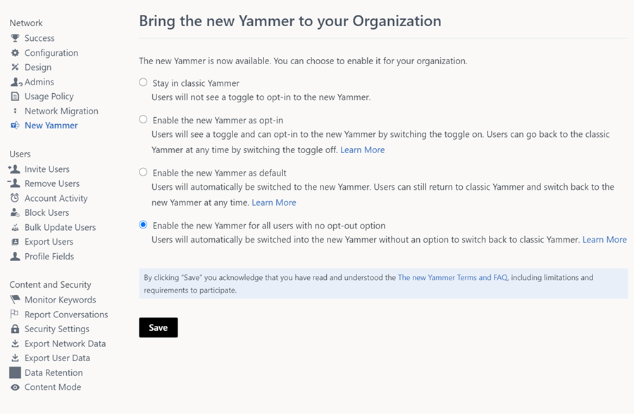

# Bring new Yammer to your organization

Global admins can now control participation in new Yammer for your organization. Please note that only one of these settings can be selected at a time. You can go back and forth between these options but we strongly recommend understanding what selecting and unselecting each setting entails before making that choice.

## Stay in Classic Yammer

This option, which when it shows up as the default setting for your organization, means that you have not yet rolled out new Yammer to your organization. If you have already rolled out the new Yammer experience, you can also select this option to remove access to the toggle that allows users to opt into the new Yammer experience.

This option does not stop users from accessing a direct link to the new Yammer experience. If your organization wants to remove all access to new Yammer, you will need to [contact Microsoft support](https://docs.microsoft.com/microsoft-365/admin/contact-support-for-business-products?view=o365-worldwide&tabs=online).

## Enable the new Yammer as opt-in

Selecting this option ensures that users in your organization are able to see the **New Yammer** toggle to opt into new Yammer from the classic Yammer experience.

Users would be able to opt out of the new experience at any time, using the opt-out toggle.

If at any point you want to remove access to the toggle, select the first option, **Stay in Classic Yammer**. Here is what going back to this setting involves:

- Users in the classic Yammer experience would no longer be able to see the toggle to opt into the new Yammer.
- Users who are already opted into the new Yammer experience would stay opted in but they will have the option to opt out of the new experience using the opt-out toggle. 
- Users can also continue to access new Yammer through direct links that are shared on apps outside of Yammer, such as Microsoft Outlook and Microsoft Teams, or by directly typing the new Yammer URL on the address bar. When they do this, they will encounter an opt-in dialog box prompting them to opt into the new Yammer experience. When they click **Let’s Go**, it opts in the user to the new experience.

    

- If the user clicks on **Not Now**, the user will be taken to the corresponding page on the classic Yammer experience.

## Enable the new Yammer as default

Selecting this option would ensure users in your organization are able to see the **New Yammer** toggle  to opt into the new Yammer  from the classic Yammer experience, and users who have never tried the new experience would automatically be switched to new Yammer. 

Users can choose to opt-out of this new experience and go back to the classic Yammer at any point.

- This would not impact those users who have tried new Yammer before and made the explicit choice to opt out of it. These users would continue to stay in the classic Yammer experience. 
- Users who have already opted in through the opt-in toggle are not impacted. These users would stay in the new experience but can opt out at any time through the opt-out toggle. 
- If your organization is completely new to Yammer, and you want all your users to directly move to the new Yammer experience, the **Enable the New Yammer as default** setting is the one we recommend.

If at any point you want to remove access to the toggle, please select the first setting, **Stay in Classic Yammer**. Here is what that would involve:

- Users on the classic Yammer experience would no longer be able to see the toggle to opt into the new Yammer.
- Users who are already opted into the new Yammer experience would stay opted in but they will have the option to opt out of the new experience using the opt-out toggle.
- Users can also continue to access the new Yammer through direct links that are shared on apps outside of Yammer, such as in Microsoft Outlook or Microsoft Teams, or by directly typing the new Yammer URL on the address bar. When they do this, they will encounter an opt-in dialog prompt asking them to opt into the new Yammer experience. If the user clicks **Let’s Go**, it would opt the user into the new Yammer experience. If the user clicks on **Not Now**, he or she will be taken to the corresponding page on the classic Yammer experience.

    

- If your organization wants to remove all access to the new Yammer, you will need to [contact Microsoft support](https://docs.microsoft.com/microsoft-365/admin/contact-support-for-business-products?view=o365-worldwide&tabs=online).

>[!NOTE]
> Please note that users can access the new experience through a direct link. If your organization wants to remove all access to the new Yammer you will need to contact Microsoft support. If you remove all access, then users from all networks in a 1:M (1-to-many) scenario will no longer be able to access the new Yammer features.

## FAQ

**Q: Which networks get the opt-in toggle?**

A: In some situations, multiple Yammer networks are connected to a single Microsoft 365 tenant. This is called a 1 tenant: many networks (1:M) configuration. All networks attached to the tenant can get the toggle, but each will need to be enabled independently. We recommend that administrators consolidate down to a single network.

## Related articles

[New Yammer FAQ](newyammer-faq.md)

[Yammer Blog](https://techcommunity.microsoft.com/t5/yammer-blog/bg-p/YammerBlog)

[Yammer admin Help](https://docs.microsoft.com/yammer/yammer-landing-page)

[Yammer admin key concepts](https://docs.microsoft.com/yammer/get-started-with-yammer/admin-key-concepts)

[Yammer Help and Support Center for end-users](https://support.office.com/yammer)
