# Identify sentiment of comments in a Yammer group by using Azure Cognitive Services and Flow

This article shows you how to set up a Yammer group to collect feedback and ideas for continued improvement, and have one person in your organization notified immediately when a specific sentiment, such as positive or negative feedback is posted. This solution uses Azure Cognitive Services to analyze the posted messages, and uses Microsoft Flow to connect Yammer, Azure Cognitive Services, SharePoint Online and Outlook.  

Once you have this integration set up with examples of positive and negative feedback, an email will be sent to a designated person whenever a negative message is posted so that a response can be posted quickly. You can easily modify the integration to send email to track other types of opinions.

## Prerequisites

- An Azure subscription and an account with permissions to create Resource groups and other Azure resources.
 
- An Office 365 license: Business Essentials/Premium or Enterprise E1/E3/E5. 

## Step 1: Download flow package needed for this integration

This article has an associated flow package that is stored in the file DetectSentiment.zip.

- [Download the DetectSentiment.zip file from the Yammer technical community](https://go.microsoft.com/fwlink/?linkid=2065917).

    |**File**|**Description**|
    |:-------|:--------------|
    |DetectSentiment.zip|Zip file containing a package for the flow that connects Yammer to Azure Cognitive Services.|

## Step 2: Create Yammer group

In this step, you create the Yammer group to post the messages to. 

1. In a web browser, open [https://www.yammer.com](https://www.yammer.com), and sign in with your organization account. 

2. In Yammer, click **+ Create a group.**
 
    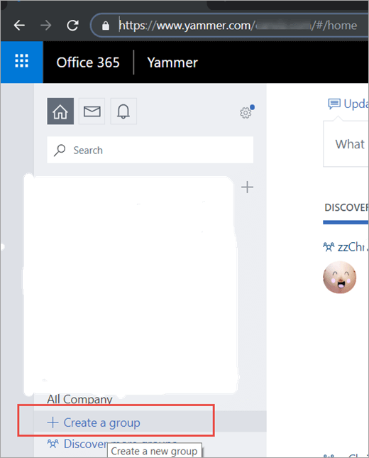

3. Click **INTERNAL GROUP.**  

    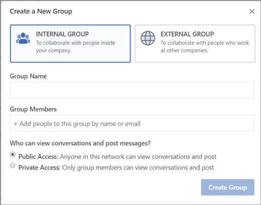

    a. Enter a **Group Name**. For example: **zzYammerGroup**. 

    b. Enter **Group Members**.

    b. Select **Public Access**.

4. Click **Create Group**.  

    The newly created group is added in the left navigation.
    
    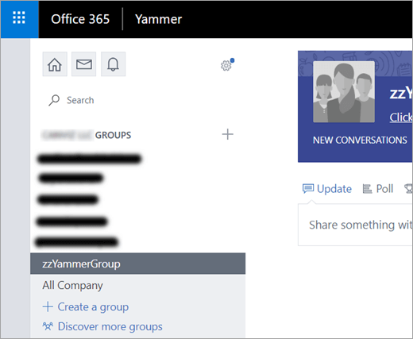

## Step 3: Create a SharePoint list to store sentiment data

In this step, you create a SharePoint list to store the sentiment data that Azure Cognitive Services uses to determine what is negative feedback. 

1. Click the button in the top left of the screen and select **SharePoint**.  

    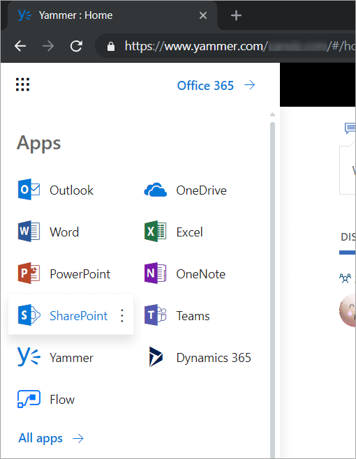

    Make sure you would have necessary permissions to create a SharePoint list in a SharePoint site.

2. Create a new list named **SentimentAnalysis**.  

    a. Click **+ New** > **List**.  

      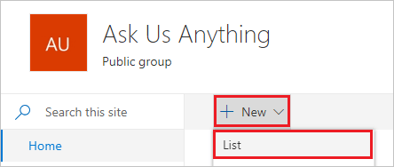

    b.  In the Name textbox, enter **SentimentAnalysis**, then click **Create**.  

      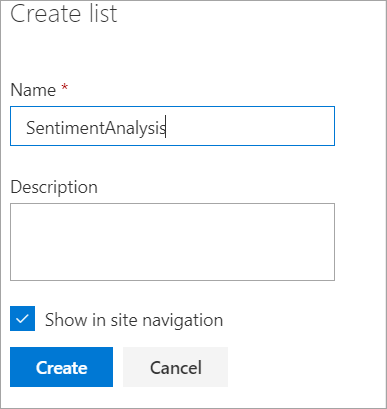

3. Create a new column named **Score**.

    a. Click **+ Add column** > **Number**.  

      

   b. In the **Name** textbox, enter **Score**, then click **Save**.  

      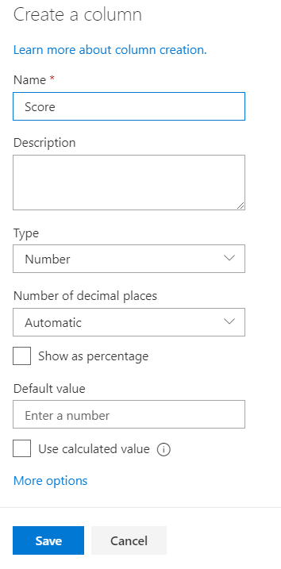

4. Create a new column named **Message Link**.  
    a. Click **+ Add column** > **Hyperlink**.  
    
      

    b. In the **Name** textbox, enter **Message Link**, then click **Save**.  

      

5. Copy and save the URL to the list you created, you will need it in subsequent steps.  

## Step 4: Create a Cognitive Service

Create a Cognitive Service to perform sentiment analysis for the messsages posted in the Yammer group.

1. In a web browser, open the [Azure Portal](https://portal.azure.com). 

2. Click **+ Create a resource**, then enter **Cognitive Services** in the search box. 
    
    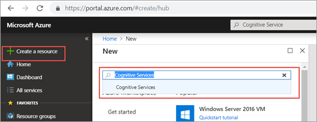
 
    a. Select **Cognitive Services**. 
 
    

     b. Click the **Create** button.  

    

3. Create a Cognitive Service 
 
    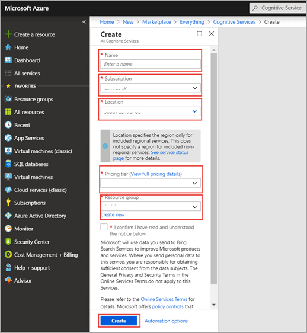

    a. Enter a **Name**. For example: SentimentAnalysis 
    
    b. Select a **Subscription.** 
    
    c. Select a **Location.** 
    
    d. Select a **Pricing tier** For example: S0  
    
    e. Create a new **Resource group.**  
    
    f. Click the **Create** button.  
    
    A new Cognitive Services instance is created. 

4. Select the Cognitive Service you just created. You will find it in the new Resource group. 

    

5. In the **RESOURCE MANAGEMENT** section, click **Keys**. 

6. Copy and save the **NAME** and **KEY** values, you will need them in subsequent steps.  

    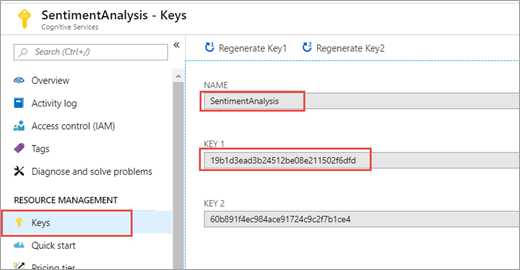

7. Click the **Overview** section.   

8. Copy and save the **Endpoint** value. You will need it in subsequent steps. 

    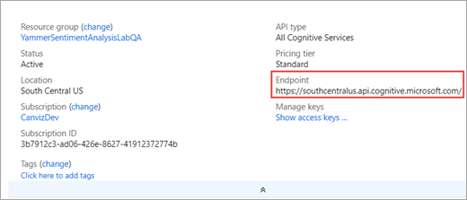

## Step 5: Import and update the Yammer Sentiment Analysis flow

Use the Yammer Sentiment flow zip file you downloaded in Step 1 and update it to work in your environment. 

1. In a web browser, open [https://flow.microsoft.com](https://flow.microsoft.com), and sign in with your work account.  

2. Upload the package.  

    a. Click **My flows**.  

      

    b. Click **Import**.  

      

    c. Click **Upload**, then select the **DetectSentiment.zip** file you downloaded.    

      

3. After the package has been uploaded, modify the **IMPORT SETUP** configuration for the **Related resources**.  

    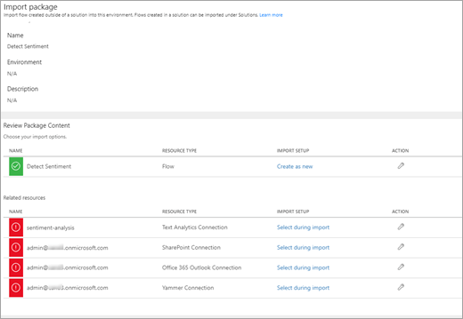

    a. In the **sentiment-analysis** resource, click **Select during import**.  
    
      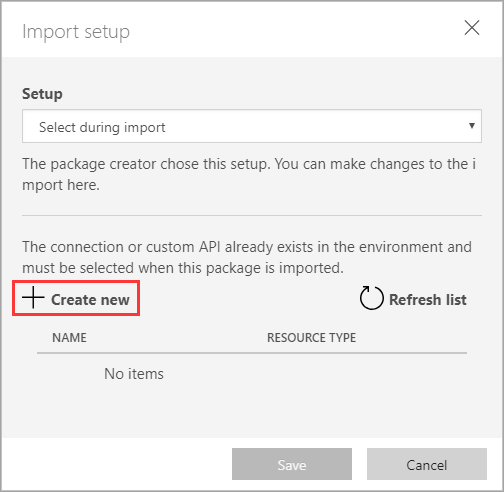
    
    b. Click **+ Create new**.  
    
      
    
    c. Click **+ New connection**, then search for **Text Analytics**.  
    
      
    
    d. Click the **Text Analytics** connector provided by Microsoft.  
        
      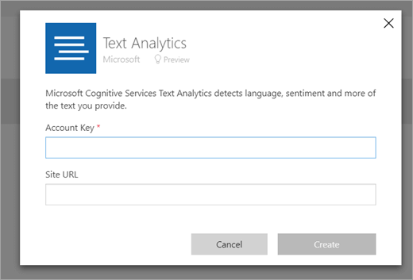

4. Enter the **KEY** you saved in a previous step for the **Account Key**. 

5. Enter the **Endpoint** you saved in a previous step for the **Site URL**. 

6. Use the previous steps as a guide to configure the remaining connections (shown in the red rectangles in the picture below). Refer to the screenshots below for all the connections to help you search for and locate the appropriate connections.  

    

    a. **SharePoint Connection** 
    
      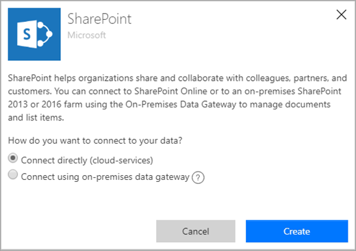
    
    b. **Office 365 Outlook Connection** 
    
      
    
    c. **Yammer Connection** 
    
      

7. Click **Import** at the bottom of the page.  

    

8. After the flow has successfully imported, click **Open flow**.  

    

9. Update the flow.  

    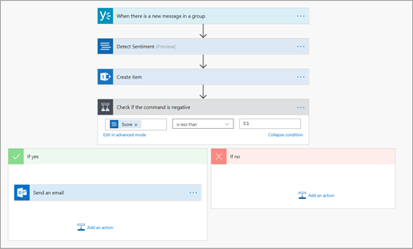

    a. Click the first node in the flow.  
    
      
    
    b. In the **Group Id** dropdown list, select the Yammer group you created earlier, then select the correct network.   
    
    c. Click the **Create item** node.  
    
      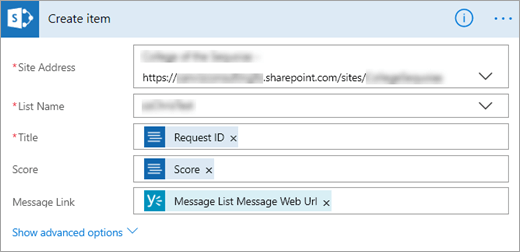

10. In the **Site address** dropdown list, select the SharePoint site where you created the SharePoint list.

11. In the **List name** dropdown list, select the Sharepoint SentimentAnalysis list you created. 
 
    a. Detect if this is negative or positive comment from Yammer group.
    
       
     
    b. Configure the email information.  
    
       
    
    c. In the **To** textbox, enter the email address where you would like notifications to be sent when the sentiment value indicates the message posted in Yammer is negative.
    
    d.  In the **Subject** textbox, enter the subject you would like the email to have.
 
12. Click **Save**.  

    

## Step 6: Post messages in the Yammer group to trigger the sentiment analysis flow

Post message in Yammer discussion group to trigger the Yammmer Sentiment Analysis flow. 

1. In a web browser, open [https://www.yammer.com](https://www.yammer.com), and sign in with your organization account.  Find and open the Yammer group you created earlier.  

    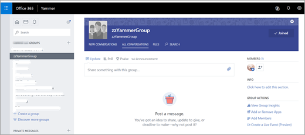

2. Post positive and negative messages to the group. 

- Negative message example: I am very frustrated by our lack of healthy eating options in the cafeteria. What can we do to improve this?

    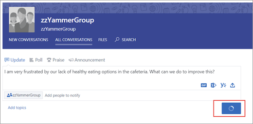

- Positive message example: I'm really loving our focus on empowering all employees to achieve more. So proud to work for the amazing company!

    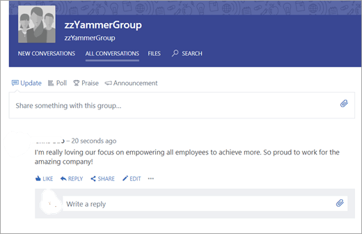 

    Both the positive and negative messages are added to the SharePoint list you created.  

     
 
    If you posted a negative message, an email is sent to the Inbox you configured. 

   

**Please note that it takes a few minutes for the flow to execute after the messages are posted to Yammer.**   

Thank you to Tim McDaniel, Microsoft MVP, for developing this integration.

