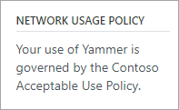

# Set up a Yammer usage policy

Creating a usage policy and requiring users to accept it can help make sure conversations on Yammer Enterprise are positive, constructive, and in line with your company policies and culture. 
  
You can choose to have the usage policy appear as a link in the side bar in each user's Yammer home screen and to display the policy as a pop-up that users must accept before entering the network. 
  

  
## Set up or modify a Yammer usage policy

1. To create or modify your usage policy and usage policy settings, in the Yammer admin center, click **Usage Policy**. 
    
2. Select when users should see the policy, and whether to display the reminder in the sidebar.
    
3. Enter your usage policy title, and sidebar message. 
    
4. Enter your usage policy text. You can use HTML code to format your usage policy. Basic HTML tags including links and basic formatting are allowed within the usage policy. (JavaScript is not allowed.) 
    
    > [!TIP]
    > Use the [Sample Yammer usage policy](set-up-a-usage-policy.md#SampleUsePolicy) for ideas of what to include. 
  
## Tips for creating your usage policy

For best results, we recommend that your usage policy:
  
- Is primarily positive and explanatory (and not just a list of "don'ts").
    
- Encourages usage by providing positive examples and suggestions.
    
- Requires that content be office‐appropriate.
    
- Includes a link for reporting inappropriate content.
    
You can include HTML links to relevant company policy information and to Yammer training resources.
  
## Sample Yammer usage policy

Here's a sample usage policy for you to start with.
  
||
|:-----|
| Welcome to Yammer! Our goal is to provide a collaborative environment to connect with colleagues and bridge our departments and geographic locations to share meaningful information.     **Your activity in this network is governed by the following requirements:** - Everything in Yammer stays in Yammer! (No public posts or Tweets, and so on). - Do not post confidential information into the main feed. - Be respectful to other members. It is acceptable to disagree, but please do so in a respectful manner. - Add value with each post.  - You are responsible for the material you post to Yammer. - It is important to substantiate ideas, but please keep messages brief and to the point.  **Get started by following these best practices:** - When you first join, select the colleagues you want to follow. Posts from these colleagues will appear in your Following feed. To see all company posts, select **All**. - Fill out your profile information. Complete the **Expertise** and **Education** sections, and be sure to add a profile picture. - Customize your email preferences in the **Notifications** section. - Before asking a question, use the search bar and explore the Topics feed to explore existing content. This will help limit repetitive messages. - Browse the Group directory and join groups that you find relevant. If a specific group does not exist, start a new one and invite members of your team to contribute. For best results, use groups as a replacement for existing email listservs. - Add Topics, Links, pictures, and Events to posts when applicable. - Use the Yammer FAQs, and How To Guide to help clarify common concerns. - Take time to explore Yammer. You'll get the hang of it!  Post a question or send a private message to [Network Admin] with any specific questions.   To report an inappropriate post, go to [link].    |
   

## Set up a Yammer browser policy

You can add a custom link to your organization's browser policy. The link will be included in the banner that is automatically displayed for some obsolete browsers. Your organization's browser policy might include information such as restrictions on which current browser to use and where to get a current browser.
  
 For example, if the admin specifies the URL for the browser policy as http&#58;//www&#46;contoso&#46;com/IT/browserpolicy&#46;htm, this is what the user will see at the top of the page when they use an old browser: 
  

  
 **Add a link to your organization's browser policy**
  
1. In the Yammer admin center, click **Usage Policy**, and then click **Set a custom browser policy URL within your company**. 
    
2. Specify the URL where your organization's browser policy is defined.
    
## Related articles

[Manage Yammer security settings](yammer-security-settings.md)
  
[Overview of security and compliance in Yammer](security-and-compliance.md)

