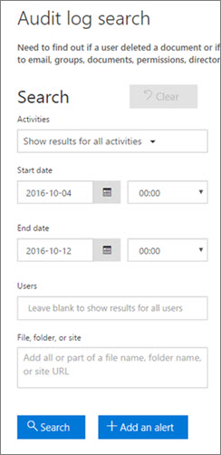

# Track Yammer events in the Office 365 audit log and with the Management Activity API

To monitor security and compliance related Yammer events for your organization, turn on audit logging and view changes to users, groups, files, admins and network settings. The audit logs are available in the Office 365 Security &amp; Compliance center or by using the Office 365 Management Activity API. 
  
You must have the Office 365 global admin role or the Audit Logs role in Exchange online to audit events. You can view Yammer events from your home network, but not from external networks. The events you can search include the following categories:
  
- **Users** —including activating, suspending, and deleting a user. 
    
- **Groups** —including creating, adding a member and deleting a group. 
    
- **Files** —including creating, viewing, and deleting a file. 
    
- **Admins** —including exporting data, triggering private content mode and forcing all users to log out. 
    
- **Network settings** —including changing network usage policy and changing data retention policy. 
    
## View the audit log in the Office 365 Security &amp; Compliance center

Before you can view the audit log, you need to [Turn Office 365 audit log search on or off](https://support.office.com/article/e893b19a-660c-41f2-9074-d3631c95a014). You only have to do this once. It takes a few hours after you turn it on before you can search the logs. 
  
To view the audit log:
  
1. Go to the [Office 365 Security &amp; compliance center](https://protection.office.com/) and sign in using your work or school account. 
    
2. Go to **Search &amp; investigation** \> **Audit log search**.
    
3. Follow the instructions for searching audit logs as described in [Search the audit log in the Office 365 Security and Compliance Center](https://support.office.com/article/0d4d0f35-390b-4518-800e-0c7ec95e946c#run).
    
    To search for Yammer-specific activities from the Office 365 audit log, select **Show results for all activities** in the **Activities** list. Use the date range boxes and the **Users** list to narrow the search results. 
    
    
  
## Learn more about the Management API

You can use the Office 365 Management Activity API to download various Yammer audit data. Read about how to register your application in Azure AD to get access to these features in [Get started with Office 365 Management APIs](https://msdn.microsoft.com/office-365/get-started-with-office-365-management-apis). For the API reference see [Office 365 Management Activity API schema](https://msdn.microsoft.com/office-365/office-365-management-activity-api-schema).
  
## See also

[Security FAQ](security-and-compliance.md#Security)
  
[Yammer - Admin Help](https://support.office.com/article/e1464355-1f97-49ac-b2aa-dd320b179dbe)

