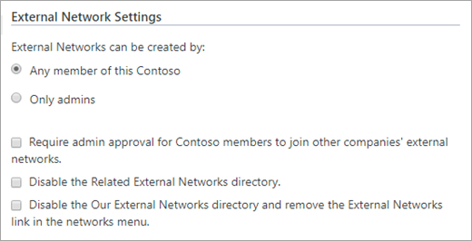

# Manage Yammer security settings

Control where people can access Yammer from, set password policies, control external network access and information, and enforce Office 365 identity.
  
## Allow access to Yammer only from the office or VPN (logical firewalls)

1. In the Yammer admin center, go to **Content and Security** \> **Security Settings**.
    
2. In the **IP Range** section, specify the IP ranges of your corporate network or other trusted networks. . 
    
3. Select whether to allow or deny login to users outside the specified ranges.
    
    Typically, users using mobile clients will be outside of the authorized IP range (unless the mobile client is using Wi-Fi on a trusted network). To allow access from mobile clients, select **Allow login**. This restricts web logins outside of your trusted IP range, but allows mobile client logins from outside the IP range. If you select **Deny login**, users outside of the trusted IP range will be unable to access Yammer via clients.
    
## Set password policies

1. In the Yammer admin center, go to **Content and Security** \> **Security Settings**.
    
2. In the **Password Policies** section, specify the password length and complexity requirements, and when passwords need to be changed. 
    
    If you change any password settings and click **Save**, users whose passwords do not meet these requirements are prompted to change their passwords upon their next logon. If you select **Force All Users to Change their Passwords Immediately** all users must change their passwords the next time they log on, regardless of any password requirement changes. 
    
    > [!NOTE]
    > External networks do not have the ability to configure password policies. This is to prevent users from being faced with multiple password strength requirement policies if they are participating in External Networks. Users have to comply with the password strength policies of their home network. 
  
## Configure security settings for all external networks

1. In Microsoft 365 or Office 365, go to **Admin** \> **Yammer** \ **External Networks**. Or, in Yammer, click your home network Yammer settings icon  , and then go to **Network Admin** \> **External Networks**.
    
2. Click **External Networks**.
    
    
  
3. Select whether any member of your home network can create an external network, or only admins. 
    
    > [!IMPORTANT]
    > If you allow any member to create a network, the person automatically becomes a network admin of the external network. 
  
4. Select ways to limit access to all external networks:
    
  - **Require admin approval for users to join other companies' external networks:** Selecting this box requires users to request approval before they join external networks created by other organizations. 
    
  - **Disable the Related External Networks directory:** The Related Networks directory is a list of external networks to which one or more of your users belong. Selecting this box removes this directory from the External Network page. 
    
  - **Disable the Our External Networks directory:** The Our External Networks directory lists all external networks attached to your Yammer network. Select this if you would like to prevent users from being able to view and requesting to join external networks. 
    
For more information about external messaging, see [External messaging FAQ (Yammer)](../work-with-external-users/external-messaging-faq.md).
  
## Prevent intellectual property from being shared with external participants and on external networks

1. In the Yammer admin center, go to **Content and Security** \> **Security Settings**.
    
2. In the **External Messaging** section, select the option that makes sense for your organization. 
    
    For information about this setting, see [Disable external messaging in a Yammer network](../work-with-external-users/disable-external-messaging.md).
    
## Enforce Office 365 identity in Yammer

1. In the Yammer admin center, go to **Content and Security** \> **Security Settings**.
    
2. In the **Office 365 Identity Enforcement** section, select **Enforce Office 365 identity in Yammer**.
    
    For information about this setting, see [Enforce Office 365 identity for Yammer users](../configure-your-yammer-network/enforce-office-365-identity.md)
    
## Learn the status of Microsoft 365 Connected Groups

1. In the Yammer admin center, go to **Content and Security** \> **Security Settings**.
    
2. Look in the **Office 365 or Microsoft 365 Connected Yammer Groups** section to see the status for your connected groups. 
    
## Related articles

[Set up a Yammer usage policy](set-up-a-usage-policy.md)
  
[Overview of security and compliance in Yammer](security-and-compliance.md)
