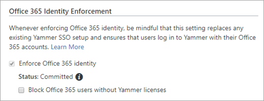
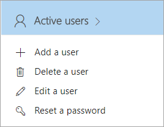
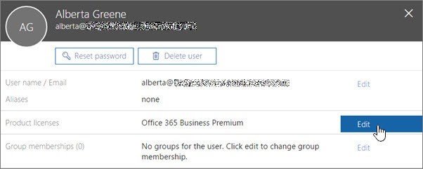

# Turn off Yammer access for Office 365 users

Yammer is included in most Office 365 subscriptions. You can disable **Yammer** for individual users, or for all users in your tenant. To keep your users from accessing Yammer, you have to first turn off their ability to sign in to Yammer with Yammer credentials, and then disable the Yammer service in their license. 
  
## Enforce Office 365 Identity in Yammer

For detailed information about enforcing Office 365 identity in Yammer and PowerShell steps, see [Start blocking users who don't have Yammer licenses](manage-yammer-licenses-in-office-365.md#StartBlocking).
  
1. In Yammer, select Yammer settings , click **Network Admin**, and then click **Security Settings**.
    
2. In the Security Settings page, go to the **Enforce Office 365 Identity** section, select the **Enforce Office 365 identity** checkbox and confirm the selection in the dialog that opens, and then choose **Save**. Enforcing Office 365 identity is a prerequisite step to block users without Yammer licenses.
    
3. After the **Enforce Office 365 identity** checkbox is selected, the **Block Office 365 users without Yammer licenses** checkbox will be available. Select the **Block Office 365 users without Yammer licenses** checkbox, confirm the selection by selecting **Yes, I am ready**. You can also optionally log out all users to force them to sign in with Office 365 credentials, and then click **Save**.
    
    
  
> [!IMPORTANT]
> This step is necessary, because if Office 365 sign-in is not enforced, users can still sign in with their Yammer credentials, if they have them. 
  
## Disable Yammer in your Office 365 tenant

1. Sign in to Office 365 with your work or school account. 
    
2. Go to the Office 365 admin center.
    
3. On the Home page, click **Active users**.
    
    
  
4. On the **Active users** page select a user for whom you want to disable Yammer. 
    
5. On the **User** pane choose **Edit** next to **Product licenses**.
    
    
  
6. Expand the product license (Office 365 Business Premium in the following example) and turn the slider for Yammer to **Off** position. 
    
    
  
7. Repeat the steps for each user you want to disable Yammer for.
    
## Use PowerShell to disable Yammer in your Office 365 tenant

You can also automate this task by using PowerShell.
  
1. Before you start, follow the instructions in [Enforce office 365 identity for Yammer users](../configure-your-yammer-network/enforce-office-365-identity.md) article to make sure your users sign in to Yammer with their Office 365 credentials. 
    
    > [!IMPORTANT]
    > This step is necessary, because if Office 365 sign-in is not enforced, users can still sign in with their Yammer credentials, if they have them. 
  
2. See [View account license and service details with Office 365 PowerShell](https://go.microsoft.com/fwlink/p/?LinkId=829181) to list what a user's license includes, and the actual names used for each service within the license. For example, it is YAMMER_ENTERPRISE for Yammer in most Office 365 plans. 
    
    The PowerShell for listing service details for all users in a tenant is also included.
    
3. See [Disable access to services with Office 365 PowerShell](https://go.microsoft.com/fwlink/p/?LinkID=717080) for detailed instructions for how to disable services, including Yammer, for one, or many users. 
    
## See also

[Can I unsubscribe myself from Yammer?](https://support.office.com/article/981ecaf7-8a7d-4312-a845-bd343e925073)

[Add, block, or remove Yammer users](add-block-or-remove-users.md)