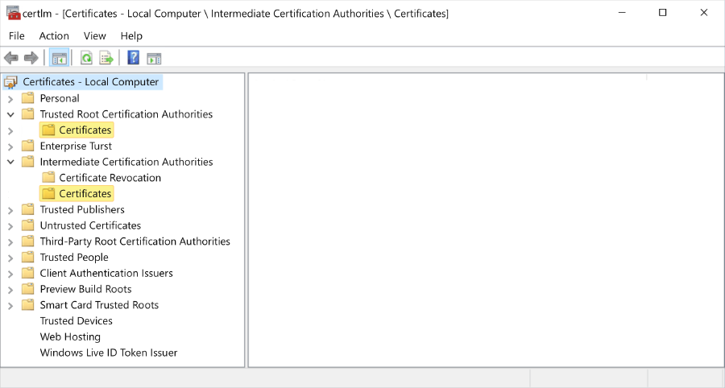
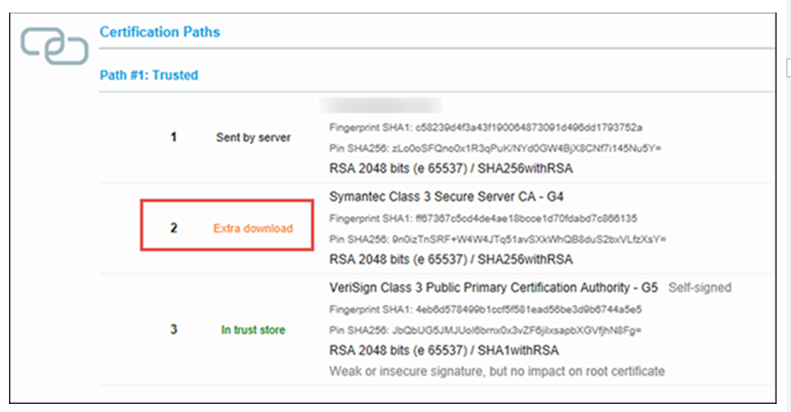

# What to do when users cannot log in to Yammer on Android devices

If users have a Yammer account, but can't log in on their device, they may need to update Android WebView.
  
On an Android device, make sure you've downloaded the latest version of [Android WebView](https://play.google.com/store/apps/details?id=com.google.android.webview&amp;hl=en) — a Chrome component that delivers security updates and lets Android apps show you content. 

If that doesn't work, your organization's security certificate is probably outdated. Forward this article to your IT admin so they can resolve the issue.
  
## Troubleshooting for Yammer and Office 365 Admins

 **Missing or outdated certificates could be preventing login authentication.**
  
Before your users can log in to Yammer, your organization's SSL certificates must pass certain checks—some required by Android, others specific to Active Directory Federation Services (AD FS). It's the safest way to protect your org's networks, user information and internal resources.
  
In fact, your servers must prove their trustworthiness to any client operating system or application whenever someone attempts to log in to a secure app (like Yammer).
  
 **And trust is complicated.**
  
There's also an entire certification hierarchy. Something called the root certification authority certificate sits at the top of it (despite what its name might imply). It issues certificates to "authorize" other, subordinate certificates called intermediate certificates. Together, all of these form a certification chain.
  
You've probably guessed that any intermediate certificates in the chain are pretty important, too—so important that Android requires that they're sent in a specific order:
  
1. First, make sure you've put the root certification authority certificate in the Trusted Root Certification store, which is on your AD FS server(s).
    
2. Then, put any intermediate certification authority certificates in the Intermediate Certification store on the Local Computer, which you'll find on your AD FS and Web Application Proxy (WAP) servers. (Run certlm.msc to open the console on a Windows computer.)
    
To make step 2 easier to understand, think of it this way: If servers were continents, then
  
- the Local Computer would be a country in those continents;
    
- the certification store would be a state (or province), and
    
- intermediate certificates would be the state population.
    

  
On a Mac computer, these categories, or folders, vary slightly. Use Spotlight to search for the "keychain access" console. For information on keychain access, see [Keychain Access overview](https://support.apple.com/kb/PH20093?viewlocale=en_US&amp;locale=en_US) on the Apple Support site. 
  
If your organization already has its certification hierarchy squared away, then you could be encountering a small issue on your Security Token Service (STS) server, explained below.
  
 **Downloading additional certificates is a common misstep.**
  
There are a couple of things that could have gone wrong with your SSL certificate(s), but the most common culprit is a server configuration that's missing an intermediate certification authority, the piece that signs your server's certificates with its private key. This triggers an AuthenticationException error when Yammer, or Office 365, tries to display the login page.
  
Someone might have downloaded additional certificates from the authorityInformationAccess field of an SSL certificate, which prevents the server from passing on the entire certificate chain from AD FS. **Android doesn't support additional certificate downloads from this field.**
  
 **Before troubleshooting, here's how you can be sure that this is an issue.**
  
Follow these 5 steps to verify whether you've got an SSL certificate that's missing necessary intermediate certificates:
  
1. Using a non-Android device, go to [https://login.microsoftonline.com](https://login.microsoftonline.com).
    
2. Log in with your work or school address as you normally would.
    
3. After you're redirected, copy the URL that's in your browser's address bar. That's your Security Token Service server's fully qualified domain name (FQDN)—omit the "https://".
    
4. Insert your FQDN in the following URL. Make sure that you replace only the letters FQDN without adding any additional characters:
    
    https&#58;//www&#46;ssllabs&#46;com/ssltest/analyze&#46;html?d=*FQDN*&amp;hideResults=on&amp;latest
    
5. Copy, paste, and go to the URL that you just completed in step 4.
    
You should see a list of SSL certificates. Look for a certificate labeled "extra download." This error signals failed authentication, indicating that AD FS couldn't pass along the entire certificate chain.
  

  
Successful authentication is marked as "sent by server."
  
 **Here's how you fix an extra download.**
  
Follow these steps to configure your Security Token Service (STS) and Web Application Proxy (WAP) servers and send the missing intermediate certificate(s) together with the SSL certificate. First, you'll need to export the SSL certificate.
  
1. Run certlm.msc to open the certificates console. Only an administrator or user who has been given the proper permissions can manage certificates.
    
2. In the console tree in the store that contains the certificate to export, click **certificates**. 
    
3. In the details pane, click the certificate that you need to export.
    
4. On the **Action** menu, click **all tasks**, and then click **export**. When the Certificate Export Wizard starts, click **next**. 
    
5. Select **yes, export the private key,** and click **next**. 
    
6. Select **Personal Information Exchange - PKCS #12 (.PFX),** and accept the default values to include all certificates in the certification path if possible. Also, make sure that the **export all extended properties** checkboxes are selected. 
    
7. If required, assign users/groups, and type a password to encrypt the private key that you are exporting. Type the same password again to confirm it, and then click **next**. 
    
8. On the File to Export page, browse the location where you want to put the exported file, and give it a name.
    
9. Using the same certificates console (certlm.msc), import the \*.PFX file into the computer's personal certificate store.
    
10. Finally, if your organization uses active load balancers to distribute traffic between servers, these servers should also have their local certificate stores updated (or at least verified).
    
If the above steps didn't work for you, look into these similar issues, or contact [Yammer Support](https://answers.microsoft.com/en-us/msoffice/wiki/msoffice_yammer-mso_o365app/welcome-to-yammer-support/2bdde618-2e1a-4983-9651-4a56f26e8e38):
  
[An external certificate that is not yet valid](https://technet.microsoft.com/en-us/library/dn383637.aspx)
  
[An external certificate that has expired](https://technet.microsoft.com/en-us/library/dn383649%28v=ws.11%29.aspx)
  
[An external certificate that doesn't have a private key](https://technet.microsoft.com/en-us/library/dn383656%28v=ws.11%29.aspx)
  
These three issues are related to the Web Application Proxy (WAP). For more information about WAP, go to [https://technet.microsoft.com/en-us/library/dn584113(v=ws.11).aspx](https://technet.microsoft.com/en-us/library/dn584113%28v=ws.11%29.aspx). 
  

